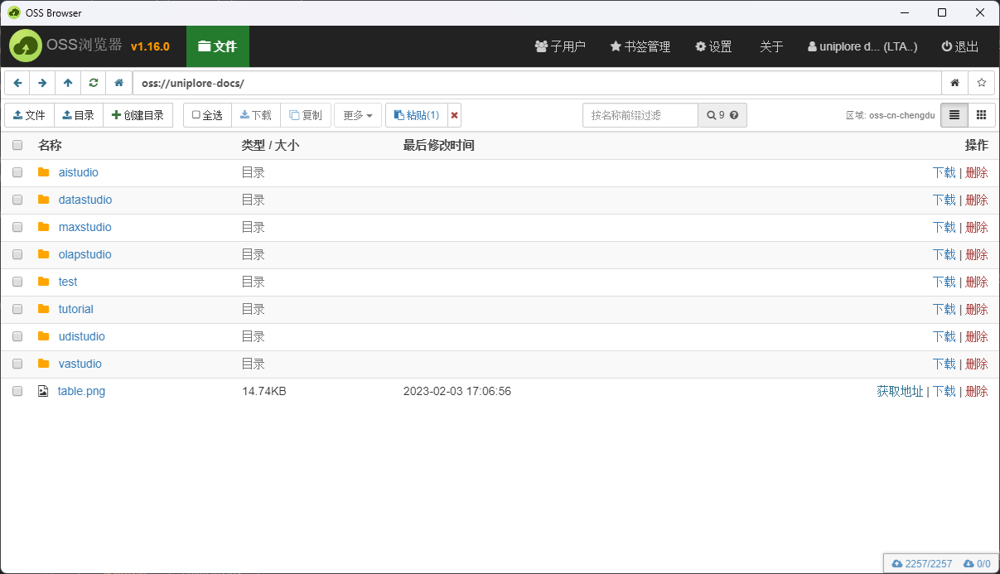
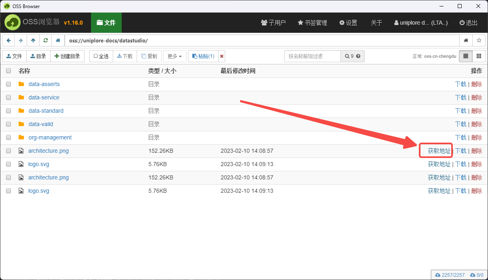

# Uniplore文档站点

> 项目中除了正常文档内容编写可以使用中文，其他原则上不允许使用作中文，如文档文件名、图片、附件等

### 安装

```
$ yarn install
```

### 本地开发

```
$ yarn start
```

此命令可以启动一个本地开发服务和打开一个浏览器窗口。绝大部分变更会实时渲染而无需再次启动服务。

### 指定语言环境运行方式

```
$ yarn start -- --locale zh-cn
```

### 文档编写说明

顶部一定要包含如下内容：

```markdown
---
title: Uniplore iDIS 概述
sidebar_position: 1
---

# 一级标题

## 二级标题

### 三级标题


```

其中：
- title标识右侧菜单栏的item标题
- sidebar_position在菜单的排序位置


### 静态资源使用说明

> 静态资源不仅仅是图片资源，包含了文档中需要用到的图片、Excel、CSV、压缩包等等！！！

1. 打开阿里云OSS浏览器，选择指定的文件夹或创建文件夹，然后上传文件



2. 复制文件地址



3. 在文档中使用示例
```markdown
[](https://uniplore-docs.oss-cn-chengdu.aliyuncs.com/maxstudio/test.png)
```

阿里云OSS文件上传工具使用文档：[https://uniplore.feishu.cn/docx/FsYddquRxorLprxyD4kcGmtJn7f](https://uniplore.feishu.cn/docx/FsYddquRxorLprxyD4kcGmtJn7f)


### 编译

```
$ yarn build
```

此命令生成静态内容到`build`文件夹且可以使用任何静态内容托管服务。

### 部署

使用SSH:

```
$ USE_SSH=true yarn deploy
```

不使用SSH:

```
$ GIT_USER=<Your GitHub username> yarn deploy
```

如果您使用Github页面进行托管，此命令是一种构建网站并推送到“gh-pages”分支的方便方法。


 > 部署github、阿里云及和腾讯云的区别在于`docusaurus.config.js`中的，详情参考文件中的url及baseUrl的区别，代码中有说明

 腾讯云部署：
 ```bash
 # 安装
 yarn global add @cloudbase/cli
# 验证
 tcb -v

# 直接授权登录方式
tcb login # 这种登录方式需要在网页进行登录授权，

# 云密钥登录方式
tcb login --apiKeyId xxx --apiKey xxx

# 查询部署任务
tcb fn list
# 部署
yarn build
cd build/
tcb hosting deploy -e uniplore-docs-7g5dauqu239bc833
 ```

### 初始化i18n(多语言)文件夹

[i18n(多语言)文件夹文档](https://docusaurus.io/docs/i18n/git)

例如:
```bash
 $ yarn write-translations -- --locale zh-cn
 ```
 或
 ```bash
 yarn write-translations -- --locale en
 ```


 ### react代码i18n(多语言环境)

简单使用

使用翻译之前
```react
import React from 'react';
import Layout from '@theme/Layout';
import Link from '@docusaurus/Link';

export default function Home() {
  return (
    <Layout>
      <h1>Welcome to my website</h1>
      <main>
        You can also visit my
        <Link to="https://docusaurus.io/blog">blog</Link>
        
      </main>
    </Layout>
  );
}
```

使用翻译之后
```react
import React from 'react';
import Layout from '@theme/Layout';
import Link from '@docusaurus/Link';

import Translate, {translate} from '@docusaurus/Translate';

export default function Home() {
  return (
    <Layout>
      <h1>
        <Translate>Welcome to my website</Translate>
      </h1>
      <main>
        <Translate
          id="homepage.visitMyBlog"
          description="The homepage message to ask the user to visit my blog"
          values={{
            blogLink: (
 <Link to="https://docusaurus.io/blog">
                <Translate
                  id="homepage.visitMyBlog.linkLabel"
                  description="The label for the link to my blog">
                  blog
                </Translate>
              </Link>
            ),
          }}>
          {'You can also visit my {blogLink}'}
        </Translate>

        
      </main>
    </Layout>
  );
}
```

more complex use [React-intl](https://www.jianshu.com/p/3b404d131634) for more advanced use-cases.

### 多版本文档

> 使用此命令创建1.1.0版本

```bash
$ yarn docusaurus docs:version 1.1.0
```

### 编译错误
如果页面路径(路由)不存在时，编译错误。

### 更多文档

More docs about docusaurus, [Click Me](https://docusaurus.io/docs)

